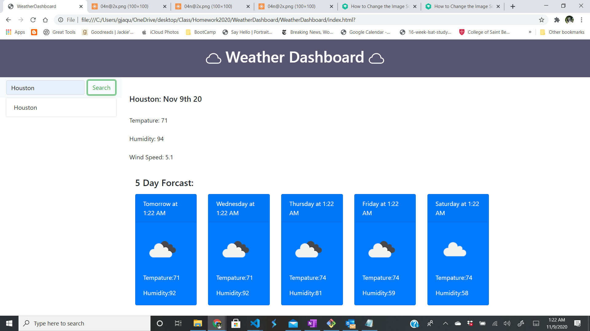

# WeatherDashboard

## Given Acceptance Critieria 
* GIVEN a weather dashboard with form inputs
* WHEN I search for a city
* THEN I am presented with current and future conditions for that city and that city is added to the search history
* I view current weather conditions for that city
* I am presented with the city name, the date, an icon representation of weather conditions, the temperature, the humidity, the wind speed, and the UV index
* I view the UV index
* I am presented with a color that indicates whether the conditions are favorable, moderate, or severe
* I view future weather conditions for that city
* I am presented with a 5-day forecast that displays the date, an icon representation of weather conditions, the temperature, and the humidity
* I click on a city in the search history
* I am again presented with current and future conditions for that city
* I open the weather dashboard
* I am presented with the last searched city forecast

## Description of HTML 

## Description of Javascript 

### Current Day Weather 
Open Weather Current Day [https://openweathermap.org/current]

### 5 Day Forcast
Open Weather 5 Day Forcast [https://openweathermap.org/forecast5]

## Live Link 

Weather Dashboard [https://buildgal.github.io/WeatherDashboard/]

## Screenshot 
